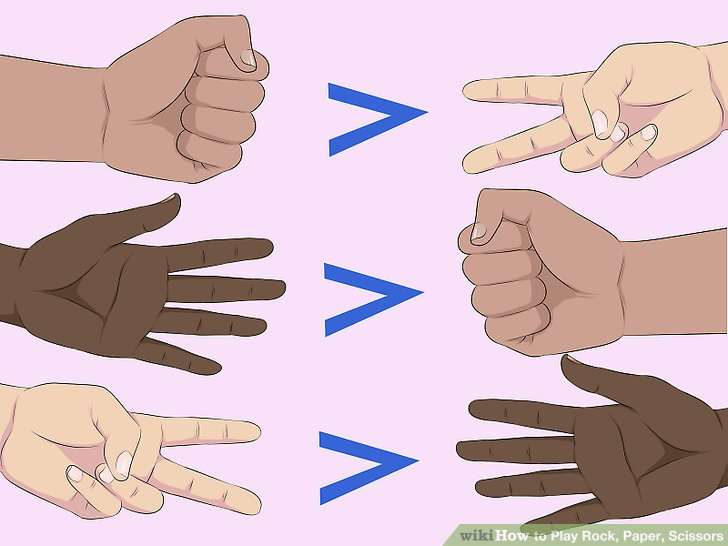

# RockPaperScissors
Perhaps you've heard of Rock Paper Scissors. This game is a popular kids game played with just your hands. Make a symbol (rock, paper, or scissors) and both players show their hand at the same time and there are rules about which symbols beat which others. Check out page for details.

wikihow.com/Play-Rock,-Paper,-Scissors

# Advanced version
